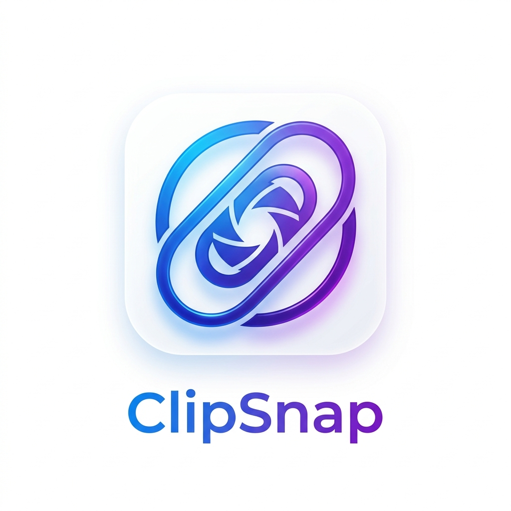

<p align="center">
  
</p>

<h1 align="center">ClipSnap</h1>

<p align="center">
  <strong>The Smarter, Faster Area Screenshot & Clipboard History Manager for Linux.</strong>
</p>

<p align="center">
  
  
  
  
  
</p>

---

**ClipSnap** is a feature-rich, high-performance clipboard utility designed for power users on Linux. Beyond simple screen captures, it allows you to extract text from images via OCR, decode QR codes instantly, and maintain a persistent history of everything you've copied.

## ⚡ Quick Install (One-Liner)

Install ClipSnap and all its dependencies (GTK4, Tesseract, SQLite) with a single command:

```bash
bash <(curl -sSL https://raw.githubusercontent.com/prathamrajbhar/clipsnap/main/install.sh)
```

> [!IMPORTANT]
> This command will clone the repository, install system dependencies via your package manager (`apt`, `dnf`, or `pacman`), and build ClipSnap from source.

---

## ✨ Key Features

- **🎯 Precision Capture**: Select any screen area with a smooth, interactive overlay.
- **📝 OCR on the Fly**: Instantly extract text from screenshots using `Tesseract OCR`—no more retyping!
- **🔍 QR Decoder**: Automatically detects and decodes QR codes within your selection.
- **📜 Infinite History**: Keep track of text and image captures in a searchable, high-performance SQLite vault.
- **⚙️ Deep Integration**: Starts on boot via XDG Autostart and lives silently in your background.
- **🎨 Modern GTK4 UI**: A sleek, contemporary interface that feels right at home on modern desktops.

---

## 🛠 Installation Guide

### Method 1: Debian Package (.deb)
*Best for Ubuntu, Linux Mint, and Debian users.*

1. **Build the package**:
   ```bash
   cargo deb
   ```
2. **Install with dependencies**:
   ```bash
   sudo apt install ./target/debian/clipsnap_*.deb
   ```

### Method 2: Automated Script
*Works on Fedora, Arch, and Debian-based systems.*

```bash
sudo ./install.sh
```

### Method 3: Manual Setup
*For developers and power users.*

1. **Install Dependencies**:
   - **Debian**: `sudo apt install build-essential pkg-config libgtk-4-dev libsqlite3-dev tesseract-ocr tesseract-ocr-eng libtesseract-dev libcairo2-dev libx11-dev libxrandr-dev libxfixes-dev`
   - **Fedora**: `sudo dnf install gcc pkgconf-pkg-config gtk4-devel sqlite-devel tesseract tesseract-devel libcairo-devel libX11-devel libXrandr-devel libXfixes-devel`
   - **Arch**: `sudo pacman -S base-devel gtk4 sqlite tesseract tesseract-data-eng cairo libx11 libxrandr libxfixes`
2. **Compile**: `cargo build --release`
3. **Deploy**:
   ```bash
   sudo cp target/release/clipsnap /usr/local/bin/
   sudo cp resources/clipsnap.desktop /usr/share/applications/
   sudo cp resources/clipsnap-autostart.desktop /etc/xdg/autostart/
   ```

---

## ⚙️ Configuration

ClipSnap stores its configuration in `~/.config/clipsnap/config.toml`. You can customize hotkeys, storage paths, and UI behavior.

**Default Hotkeys:**
- `PrintScreen`: Start Area Capture
- `Ctrl + Shift + V`: Open History Manager
- `Ctrl + Shift + O`: Extract text from selection (OCR)
- `Ctrl + Shift + Q`: Decode QR code from selection

---

## 📂 Project Structure

- `src/`: Core logic and Rust implementation.
- `resources/`: UI definitions and desktop entries.
- `assets/`: Branding and static assets.
- `install.sh`: The robust installer script.

---

## 🤝 Contributing

Contributions are welcome! Whether it's reporting bugs, suggesting features, or submitting pull requests, feel free to dive in.

1. Fork the Project
2. Create your Feature Branch (`git checkout -b feature/AmazingFeature`)
3. Commit your Changes (`git commit -m 'Add some AmazingFeature'`)
4. Push to the Branch (`git push origin feature/AmazingFeature`)
5. Open a Pull Request

---

## 📜 License

Distributed under the **MIT License**. See `LICENSE` for more information.

<p align="center">
  Made with ❤️ by <a href="https://github.com/prathamrajbhar">Pratham Rajbhar</a>
</p>
